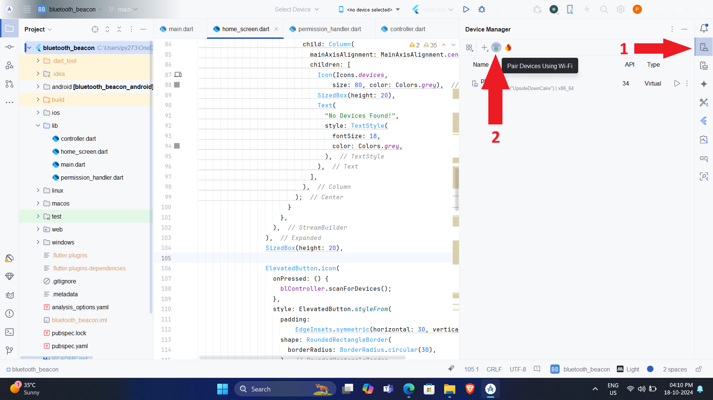
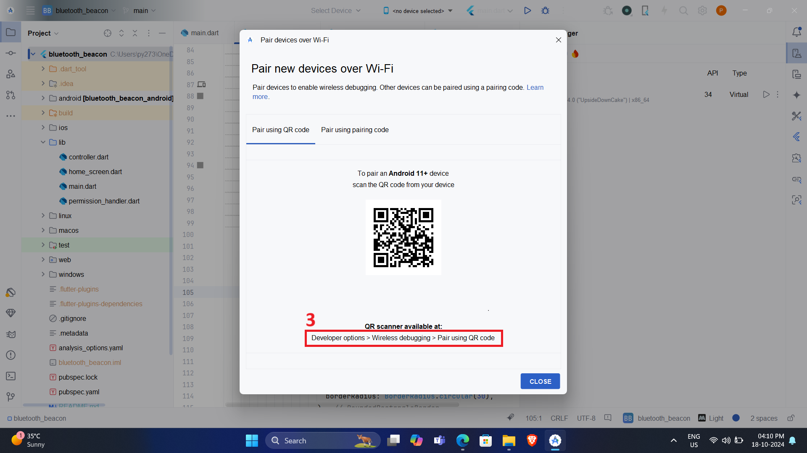
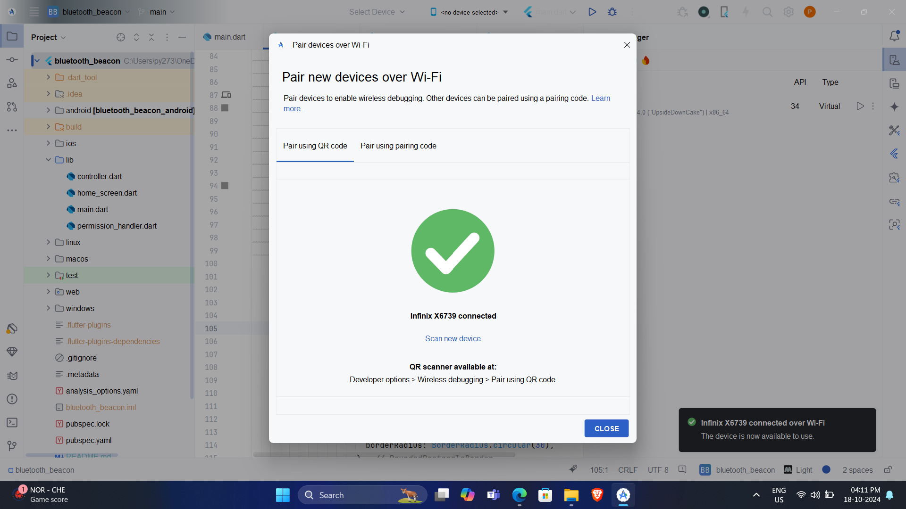
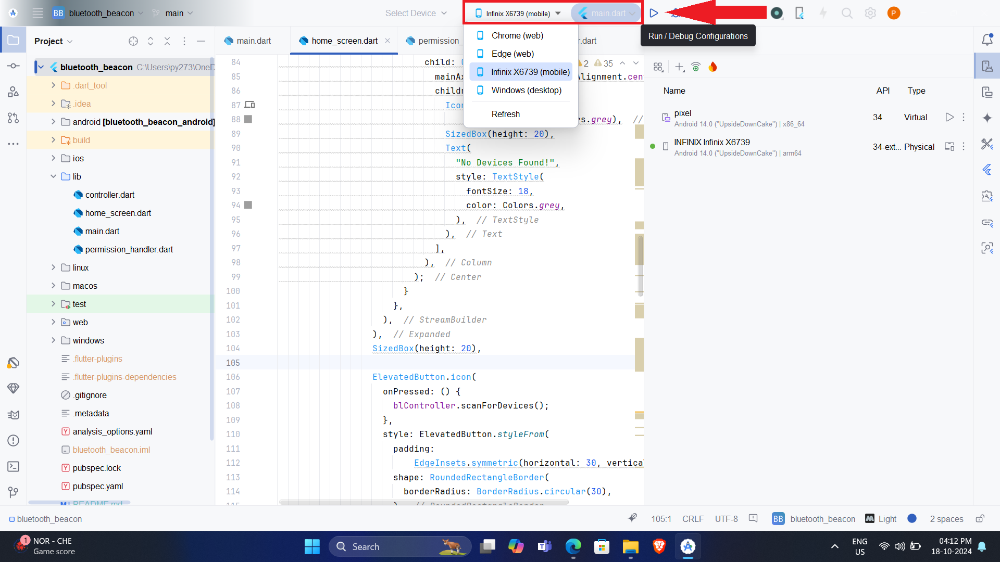

# Bluetooth Beacon

## Requirements:
- Git
- Flutter

## Steps to Run the Project:

### 1. Clone the repository using the command below:
```bash
git clone https://github.com/prashantprojection/bluetooth-beacon.git
```

### 2. Navigate to the location where you cloned the repository.

### 3. Run the following command in the terminal at the root location of the project to install the necessary dependencies:
```bash
flutter pub get
```

### 4. After successfully installing dependencies, the project is ready to run.

### 5. Launch the emulator available on your device or pair any physical device for testing.
(For example, I am using a physical device to test the application.)

## How to run the app using Android studio in your physical device
#### Follow the Steps below







