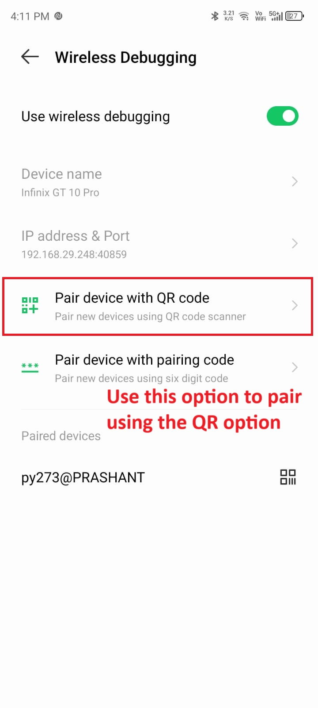
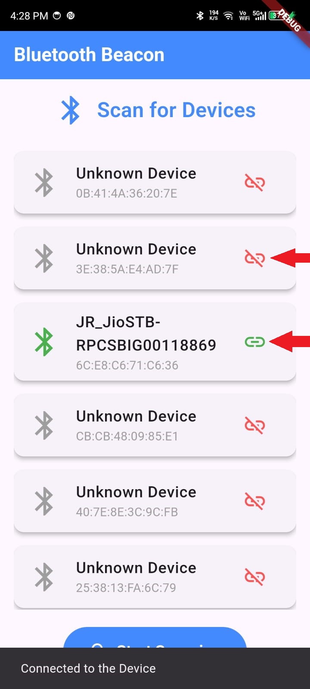

# Bluetooth Beacon

## Requirements:
- Git
- Flutter

## Steps to Run the Project:

### 1. Clone the repository using the command below:
```bash
git clone https://github.com/prashantprojection/bluetooth-beacon.git
```

### 2. Navigate to the location where you cloned the repository.

### 3. Run the following command in the terminal at the root location of the project to install the necessary dependencies:
```bash
flutter pub get
```

### 4. After successfully installing dependencies, the project is ready to run.

### 5. Launch the emulator available on your device or pair any physical device for testing.
(For example, I am using a physical device to test the application.)

## How to run the app using Android studio in your physical device
#### Follow the Steps below


#### Phone setup for debug mode
<div align="center">
  <p>
    
    
  </p>
</div>

#### If you see a success message like below in your screen then you sucessfully connected your device


#### Following this you can run the App


#### Once the Application is running it will ask for permissions -> Allow them
#### If you Deny them then you have to do it manually later on or rerun the app
<div align="center">
  <p>
    
    
  </p>
</div>

#### This is how the app will look like once running
<div align="center">

<p>Tap on the start scanning button to scan the nearby Bluetooth devices</p>
  <p>
    
    
  </p></div>>
<div align="center">
 
<p>Can press the (link icon) to Connect/Disconnect from devices</p>
 <p>
    
    
  </p>
</div>


